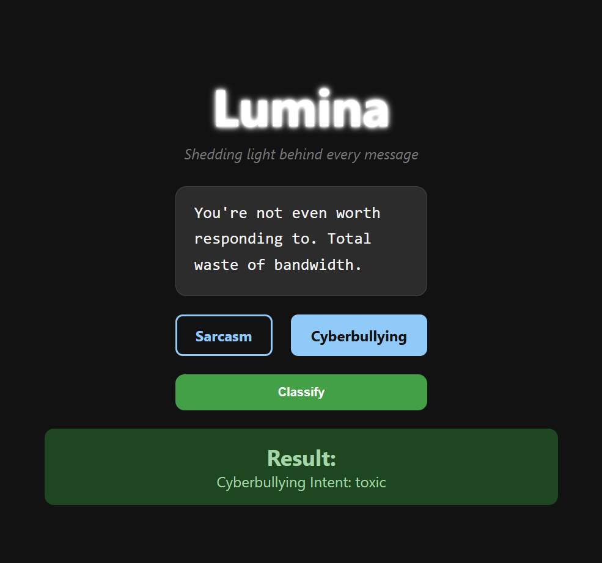

# Lumina
### _Shedding light behind every message._

Lumina is a web based text classification tool that detects **sarcasm** and **cyberbullying intent** in a message. It features a smooth, responsive interface with both **dark and light themes** using pre trained ML model.

## Features

- **ML-Powered Classification**  
  Detects whether a message is sarcastic or contains cyberbullying intent.

- **Light & Dark Mode Toggle**  
  Allows users to switch between aesthetically designed light and dark themes.
  

## Sarcasm Detection Model
- **Type:** Binary Classification

- **Output:** Sarcastic or Not Sarcastic

- **Dataset:** Trained on Reddit comments from a labeled sarcasm dataset 

Working:

Text is first preprocessed and vectorized using TF-IDF Vectorizer.

A Logistic Regression model is trained on this vectorized data.

At runtime, the model predicts whether a given message carries a sarcastic tone.

## Cyberbullying Detection Model
- **Type:** Binary or Multi-Class Classification

- **Output:** Cyberbullying Intent (e.g., Insult, Threat, Harassment, etc.) or simply Yes/No

- **Dataset:** Based on a labeled dataset of tweets and messages with categories of cyberbullying (e.g., Cyberbullying Tweets Dataset)

Working:

- Text data is vectorized using TF-IDF.

- A Multinomial Logistic Regression classifier is trained on this.

- On prediction, the model returns the intent or presence of cyberbullying based on learned patterns from toxic language.

## Peek into the webapp 

